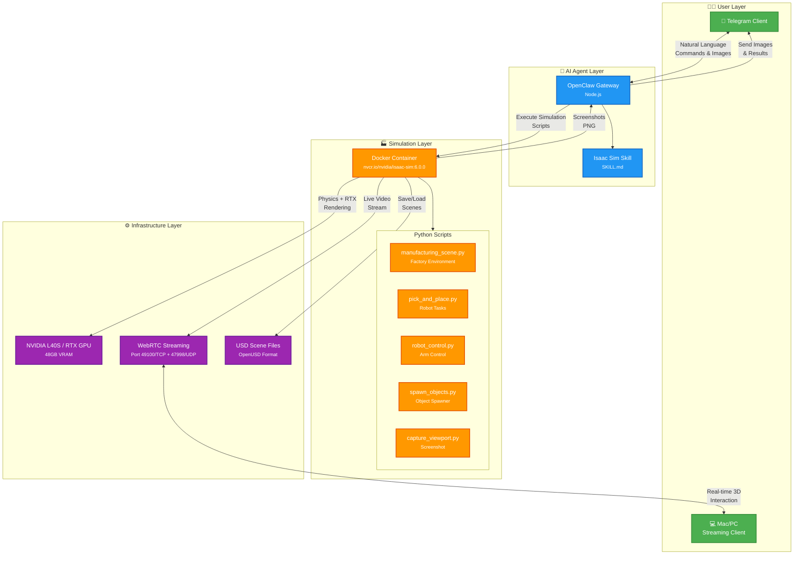

# System Architecture

```mermaid
graph TB
    subgraph User["🧑‍💻 User Layer"]
        TG["📱 Telegram Client"]
        MAC["💻 Mac/PC<br/>Streaming Client"]
    end

    subgraph Agent["🤖 AI Agent Layer"]
        OC["OpenClaw Gateway<br/><small>Node.js</small>"]
        SKILL["Isaac Sim Skill<br/><small>SKILL.md</small>"]
        OC --> SKILL
    end

    subgraph Simulation["🏭 Simulation Layer"]
        direction TB
        DOCKER["Docker Container<br/><small>nvcr.io/nvidia/isaac-sim:6.0.0</small>"]
        
        subgraph Scripts["Python Scripts"]
            MS["manufacturing_scene.py<br/><small>Factory Environment</small>"]
            PP["pick_and_place.py<br/><small>Robot Tasks</small>"]
            RC["robot_control.py<br/><small>Arm Control</small>"]
            SO["spawn_objects.py<br/><small>Object Spawner</small>"]
            CV["capture_viewport.py<br/><small>Screenshot</small>"]
        end
        
        DOCKER --> Scripts
    end

    subgraph Infra["⚙️ Infrastructure Layer"]
        GPU["NVIDIA L40S / RTX GPU<br/><small>48GB VRAM</small>"]
        WEBRTC["WebRTC Streaming<br/><small>Port 49100/TCP + 47998/UDP</small>"]
        USD["USD Scene Files<br/><small>OpenUSD Format</small>"]
    end

    TG <-->|"Natural Language<br/>Commands & Images"| OC
    OC -->|"Execute Simulation<br/>Scripts"| DOCKER
    DOCKER -->|"Physics + RTX<br/>Rendering"| GPU
    DOCKER -->|"Save/Load<br/>Scenes"| USD
    DOCKER -->|"Live Video<br/>Stream"| WEBRTC
    WEBRTC <-->|"Real-time 3D<br/>Interaction"| MAC
    DOCKER -->|"Screenshots<br/>PNG"| OC
    OC -->|"Send Images<br/>& Results"| TG

    classDef userStyle fill:#4CAF50,stroke:#388E3C,color:#fff,stroke-width:2px
    classDef agentStyle fill:#2196F3,stroke:#1565C0,color:#fff,stroke-width:2px
    classDef simStyle fill:#FF9800,stroke:#E65100,color:#fff,stroke-width:2px
    classDef infraStyle fill:#9C27B0,stroke:#6A1B9A,color:#fff,stroke-width:2px

    class TG,MAC userStyle
    class OC,SKILL agentStyle
    class DOCKER,MS,PP,RC,SO,CV simStyle
    class GPU,WEBRTC,USD infraStyle
```
